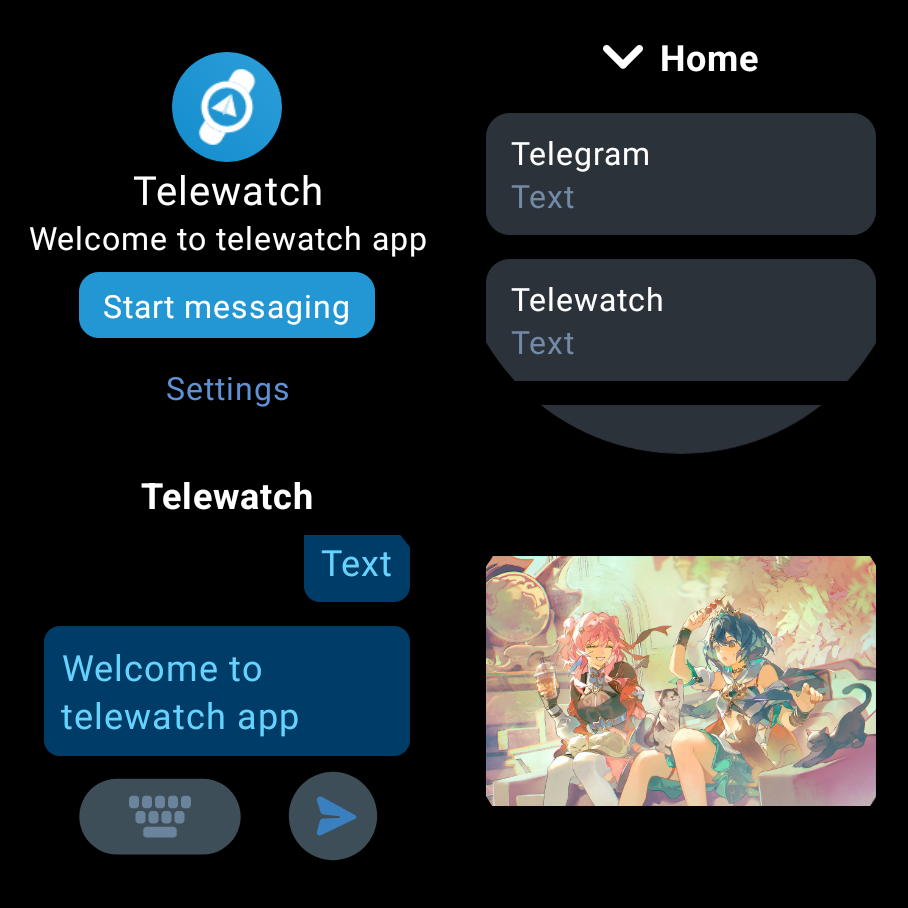

<a href="https://github.com/gohj99/Telewatch">

</a>

<div align="center">
  <br/>
  <div>
      简体中文 | <a href="./README.md">English</a> | <a href="./README.zh-TW.md">繁體中文</a> | <a href="./README.ja-JP.md">日本語</a>
  </div>
  <br/>

<div>
    <a href="https://github.com/gohj99/Telewatch/blob/master/LICENSE">
      
    </a >
    <a href="https://github.com/gohj99/Telewatch/releases">
        
    </a >
  </div>
</div>



## 下载

下载: [Telewatch](https://github.com/gohj99/Telewatch/releases)  
ADB Shell:

1. 从releases下载Telewatch
2. 安装:

```shell
adb install Telewatch.apk
```

## 功能

- 多账号支持
- 界面字体调节
- 未读/已读指示器
- 连接状态指示器
- 文字、图片、视频查看或下载
- 保存图片或视频
- 文字发送
- 编辑消息处理
- 删除消息处理
- 支持表冠旋转

## 最低配置和推荐配置

- 最低内存(RAM): 1G
- 最低存储空间(ROM): 8G
- 最低兼容的系统: Android 7.0 (API Level 24 Nougat)
- 推荐内存(RAM): 2G
- 推荐存储空间(ROM): 16G
- 推荐的系统: Android 11 (API Level 30 R) or Wear OS 3.0 (API level 30)

## 反馈

推荐使用[issue](https://github.com/gohj99/Telewatch/issues)来反馈。
当然，以下反馈方式也是可行的：

- [Telegram](https://t.me/teleAndroidwatch)

## Star History

<a href="https://star-history.com/#gohj99/Telewatch&Date">
 <picture>
   <source media="(prefers-color-scheme: dark)" srcset="https://api.star-history.com/svg?repos=gohj99/Telewatch&type=Date&theme=dark" />
   <source media="(prefers-color-scheme: light)" srcset="https://api.star-history.com/svg?repos=gohj99/Telewatch&type=Date" />
   
 </picture>
</a>
