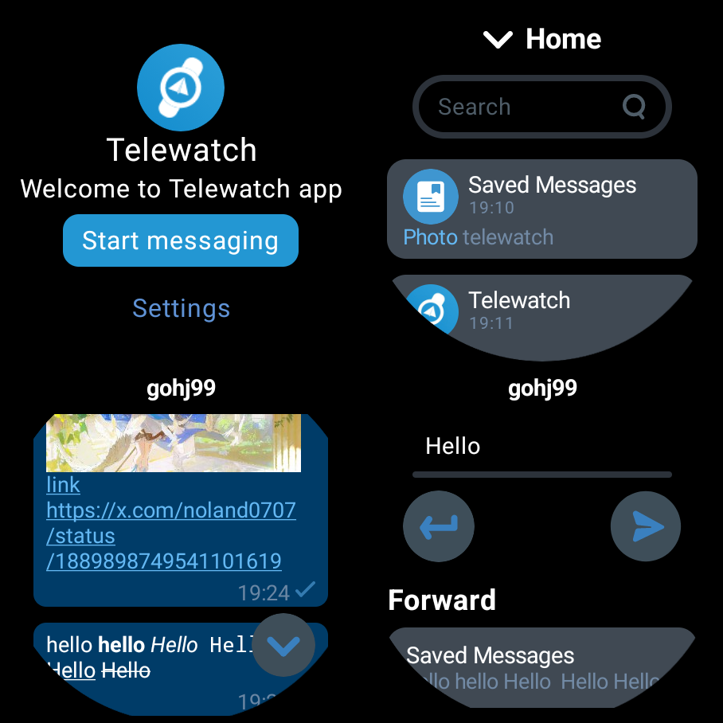

<a href="https://github.com/gohj99/Telewatch">

</a>

<div align="center">
  <br/>
  <div>
      繁體中文 | <a href="./README.md">English</a> | <a href="./README.zh-CN.md">简体中文</a> | <a href="./README.ja-JP.md">日本語</a>
  </div>
  <br/>

<div>
    <a href="https://github.com/gohj99/Telewatch/blob/master/LICENSE">
      
    </a >
    <a href="https://github.com/gohj99/Telewatch/releases">
        
    </a >
  </div>
</div>



## 下載

下載: [Telewatch](https://github.com/gohj99/Telewatch/releases)  
ADB Shell:

1. 從releases下載Telewatch
2. 安裝:

```shell
adb install Telewatch.apk
```

## 功能

- 多帳號支持
- 介面字體調節
- 未讀/已讀指示器
- 連線狀態指示器
- 文字、圖片、影片檢視或下載
- 儲存圖片或視頻
- 文字發送
- 刪除訊息
- 支援錶冠旋轉

## 最低配置和建議配置

- 最低記憶體(RAM): 1G
- 最低儲存空間(ROM): 8G
- 最低相容的系統: Android 7.0 (API Level 24 Nougat)
- 推薦記憶體(RAM): 2G
- 建議儲存空間(ROM): 16G
- 建議的系統: Android 11 (API Level 30 R) 或 Wear OS 3.0 (API level 30)

## 回饋

建議使用[issue](https://github.com/gohj99/Telewatch/issues)來回饋。
當然，以下回饋方式也是可行的：

- [Telegram](https://t.me/teleAndroidwatch)

## Star History

<a href="https://star-history.com/#gohj99/Telewatch&Date">
 <picture>
   <source media="(prefers-color-scheme: dark)" srcset="https://api.star-history.com/svg?repos=gohj99/Telewatch&type=Date&theme=dark" />
   <source media="(prefers-color-scheme: light)" srcset="https://api.star-history.com/svg?repos=gohj99/Telewatch&type=Date" />
   
 </picture>
</a>
